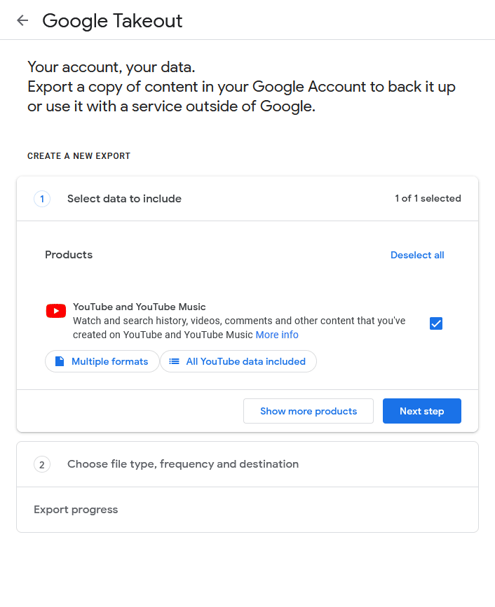

# YouTube Subscriptions to RSS Feeds
This python scripts converts a `subscriptions.csv` Google Takeout file, to a list of valid RSS feeds for the associated YouTube subscriptions.

# Instructions

### Google Takeout

- Go to the [YouTube section of Google Takeout](https://takeout.google.com/settings/takeout/custom/youtube).

- Press the `All YouTube data included` button and deselect all, then select `subscriptions`

- Click `next step`, select your desired destination and click `Create Export`

### Python Script

- Download the `takeout.zip` file and locate `subscriptions.csv`, it should be in `Takeout\YouTube and YouTube Music\subscriptions`

- Place your `subscriptions.csv` in the same folder as `convertsubscriptionstorssfeeds.py`, then run the `convertsubscriptionstorssfeeds.py` file. After is has been ran, a `rssfeeds.txt` file will be generated, the RSS feeds will be located in that file.

- Insert the RSS feeds into a feed reader and receive updates about videos from subscribed channels there.

*Pictured: A YouTube-supported fork of Fluent Reader - [https://github.com/langballe/fluent-reader](https://github.com/langballe/fluent-reader)*
